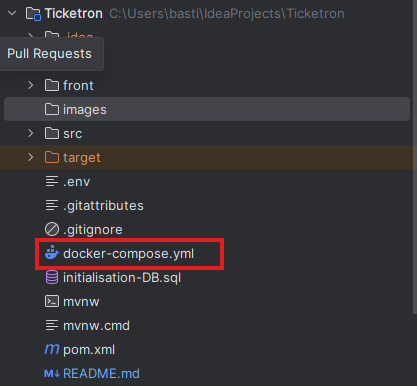

### Ticketron

Ticketron est une application web conçue pour la gestion de note de frais.
Elle permet aux utilisateurs de dialoguer avec un assistant virtuel en transmettant des photos de leurs reçus.
Afin d'extraire les informations pertinentes, de les enregistrer et de générer des rapports de dépenses.

### Membres du projet :

- MOUNGONDO Alberto
- BALMES Bastien
- MEDARD Guillaume

###  Lancement des Dockers

#### Pré-requis
Avant tout, assurez-vous d’avoir **WSL** installé et configuré.

Le projet utilise **deux conteneurs Docker** :
- **Base de données MySQL**
- **Serveur LLaMA 3.1 en local**

#### Étape 1 – Base de données MySQL

---

#### Méthode 1 – Depuis IntelliJ IDEA
1. Ouvrez l’arborescence du projet.
2. Recherchez le fichier **`docker-compose.yml`**.
3. Cliquez sur l’icône **verte ▶️** à côté du fichier pour lancer le conteneur.

---

#### Méthode 2 – Depuis le terminal (Git Bash ou CMD)
1. Ouvrez un terminal à la **racine du projet**.
2. Exécutez la commande suivante :

    docker compose up

---

#### Étape 2 – Serveur LLaMA 3.1 en local

Pour cette étape, ouvrez un **terminal Bash** à la **racine du projet**, puis exécutez :

    ./serverLlma.sh

Cette commande va pull l’image de LLaMA 3.1 et lancer un conteneur Docker avec ce LLM.

Une fois l’image et le conteneur en place, démarrez le serveur :

    docker start ollama

### Optionnel Version optimisée (performances)

Utilisez cette commande pour une exécution plus performante :

    docker run -d --name ollama \
        --gpus all \
        --cpus="10" \
        --memory="16g" \
        -p 11434:11434 \
        -e OLLAMA_KEEP_ALIVE=30m \
        -e OLLAMA_MAX_LOADED_MODELS=1 \
        -v ollama:/root/.ollama \
        ollama/ollama:latest

---

### TODO :
+ [x] Développer l'OCR pour extraire les informations des factures
+ [x] Intégrer un LLM pour analyser les informations extraites par l'OCR
+ [ ] Verifier que l'OCR arrive a extraire les informations de plusieurs factures
+ [ ] Permettre au LLM de créer des catégories de dépenses en base et lui permettre de récupéer les existantes
+ [ ] Donner les tools nécessaire au LLM pour transformer des objets JSON en objet JAVA
+ [ ] Permettre au LLM d'enregistrer les objets JAVA dans une base de données avec les repositories
+ [ ] Créer les différentes routes API pour communiquer avec le front
+ [ ] Développer l'interface utilisateurs en react

Et comme un projet n'est que très rarement terminé :
+ [ ] Faire les tests unitaires et d'intégration
+ [ ] Installer checkstyles et autres outils de qualité de code et respecter les normes 

:D

